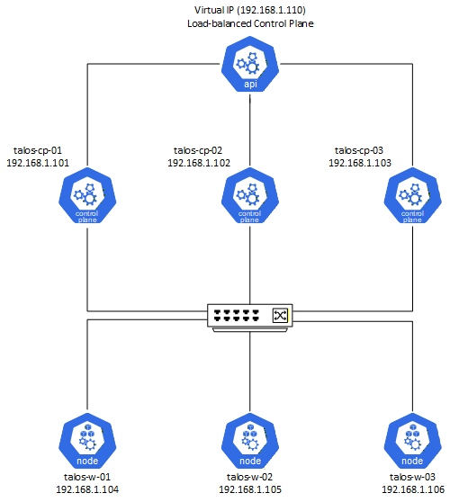

# 🧊 Kubernetes Cluster on Talos Linux (Raspberry Pi 4)

A complete, step-by-step guide for deploying a **highly available Kubernetes cluster** on **Talos Linux** using **6 Raspberry Pi 4** boards (3 control planes + 3 workers).  
This setup uses a **Virtual IP (VIP)** for API server redundancy and provides a fully automated, immutable, and secure Kubernetes environment.

---

## 📑 Table of Contents

1. [Overview](#-overview)  
2. [Architecture](#%EF%B8%8F-architecture)
3. [Architecture Diagram](#%EF%B8%8F-architecture-diagram)
4. [Prerequisites](#%EF%B8%8F-prerequisites)  
5. [Preparing Raspberry Pi Nodes](#-preparing-raspberry-pi-nodes)  
6. [Talos Configuration](#-talos-configuration)  
7. [Applying Configurations](#-applying-configurations)  
8. [Bootstrapping the Cluster](#-bootstrapping-the-cluster)  
9. [Accessing Kubernetes](#-accessing-kubernetes)  
10. [Verification](#-verification)  
11. [Author](#-author)

---

## 🧭 Overview

This project demonstrates how to run a **production-ready Kubernetes cluster** on ARM-based hardware using **Talos Linux**, a minimal and immutable OS built specifically for Kubernetes.

Talos simplifies management, enhances security, and eliminates SSH — all system interactions are handled through the `talosctl` API.

---

## 🗺️ Architecture

| Role | Hostname | Example IP | Description |
|------|-----------|-------------|--------------|
| Control Plane 1 | `talos-cp-01` | 192.168.1.101 | Control plane node |
| Control Plane 2 | `talos-cp-02` | 192.168.1.102 | Control plane node |
| Control Plane 3 | `talos-cp-03` | 192.168.1.103 | Control plane node |
| Worker 1 | `talos-w-01` | 192.168.1.104 | Worker node |
| Worker 2 | `talos-w-02` | 192.168.1.105 | Worker node |
| Worker 3 | `talos-w-03` | 192.168.1.106 | Worker node |
| VIP | - | 192.168.1.110 | Virtual IP shared by control planes |

---

## 🗺️ Architecture Diagram



---

## ⚙️ Prerequisites

Ensure the following before proceeding:

- 6x Raspberry Pi 4 (4 GB or 8 GB RAM)
- DHCP server for initial IP assignment
- [Talosctl](https://www.talos.dev/v1.7/introduction/getting-started/#talosctl) and [kubectl](https://kubernetes.io/docs/tasks/tools/) installed on your system (Linux/macOS/Windows)
- Local workstation with access to the same LAN

### Update EEPROM on each Raspberry Pi

Use Raspberry Pi Imager → **OS > Misc Utility Images > Bootloader > SD Card Boot**.
Insert SD card, flash EEPROM, boot device, wait for rapid blinking (10s), then power off.

---

## 💾 Preparing Raspberry Pi Nodes

1. Download the Talos ARM64 image:

   ```bash
   wget https://factory.talos.dev/image/ee21ef4a5ef808a9b7484cc0dda0f25075021691c8c09a276591eedb638ea1f9/v1.11.3/metal-arm64.raw.xz
   ```

2. Flash image to SD card using **Raspberry Pi Imager** or `dd`.

---

## 🧩 Talos Configuration

### 1. Generate Cluster Secrets

```bash
talosctl gen secrets -o secrets.yaml
```

### 2. Generate Base Configs

```bash
talosctl gen config --with-secrets secrets.yaml democluster https://192.168.1.110:6443
```

This command creates:

- `controlplane.yaml`  
- `worker.yaml`  
- `talosconfig`

### 3. Inspect Node Info

```bash
talosctl --nodes <dhcp-node-ip> get links --insecure
talosctl get disks --insecure --nodes <dhcp-node-ip>
```

### 4. Create Node Patches

Example — `controlplane-patch-1.yaml`:

```yaml
machine:
  network:
    hostname: talos-cp-01
    nameservers:
      - 1.1.1.1
    interfaces:
      - interface: end0
        addresses:
          - 192.168.1.101/24
        routes:
          - network: 0.0.0.0/0
            gateway: 192.168.1.1
        vip:
          ip: 192.168.1.110
  install:
    disk: /dev/mmcblk0
  time:
    servers:
      - time.cloudflare.com
```

Repeat for each node, adjusting hostnames and IPs.

**Note:** The `vip` section should be configured **only on control plane nodes** — worker nodes do **not** use the Virtual IP.

### 5. Patch Machine Configs

```bash
talosctl machineconfig patch controlplane.yaml --patch @controlplane-patch-1.yaml --output controlplane-1.yaml
talosctl machineconfig patch controlplane.yaml --patch @controlplane-patch-2.yaml --output controlplane-2.yaml
talosctl machineconfig patch controlplane.yaml --patch @controlplane-patch-3.yaml --output controlplane-3.yaml
talosctl machineconfig patch worker.yaml --patch @worker-patch-1.yaml --output worker-1.yaml
talosctl machineconfig patch worker.yaml --patch @worker-patch-2.yaml --output worker-2.yaml
talosctl machineconfig patch worker.yaml --patch @worker-patch-3.yaml --output worker-3.yaml
```

---

## ⚡ Applying Configurations

Apply generated configuration files to each node:

```bash
talosctl apply-config --insecure --nodes <dhcp-ip> --file controlplane-1.yaml
talosctl apply-config --insecure --nodes <dhcp-ip> --file controlplane-2.yaml
talosctl apply-config --insecure --nodes <dhcp-ip> --file controlplane-3.yaml
talosctl apply-config --insecure --nodes <dhcp-ip> --file worker-1.yaml
talosctl apply-config --insecure --nodes <dhcp-ip> --file worker-2.yaml
talosctl apply-config --insecure --nodes <dhcp-ip> --file worker-3.yaml
```

Merge configuration:

```bash
talosctl config merge ./talosconfig
```

---

## 🧠 Bootstrapping the Cluster

Set endpoints and bootstrap control plane:

```bash
talosctl config endpoint 192.168.1.101 192.168.1.102 192.168.1.103
talosctl bootstrap --nodes 192.168.1.101
```

*(Run `bootstrap` once, on one control plane.)*

---

## 🔑 Accessing Kubernetes

Retrieve the kubeconfig:

```bash
talosctl kubeconfig --nodes 192.168.1.101
```

If you manage multiple clusters:

```bash
talosctl kubeconfig alternative-kubeconfig --nodes 192.168.1.101
export KUBECONFIG=./alternative-kubeconfig
```

---

## 🧾 Verification

Check node readiness:

```bash
kubectl get nodes -o wide
```

You should see all four nodes (`Ready` state).

---

## 👤 Author

**Przemyslaw Pradela**  

- 💼 GitHub: [@ppradela](https://github.com/ppradela)
- 🔗 LinkedIn: [przemyslaw-pradela](https://www.linkedin.com/in/przemyslaw-pradela)

